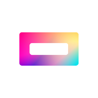

  
  

   
  

  <h1 align="center"><b>SimploVR</b></h1>
  

  A cheap but incredible way to vr.
     
    <a href="https://simplovr.mintlify.app"><strong>Build It »</strong></a>
  

  

# What is SimploVR?
SimploVR is a cheap virtual reality headset that provides a incredible VR experience for users. It brings 6-degree-of-freedom (6DoF) tracking, controllers, and compatibility with SteamVR, enabling users to interact with virtual environments in the best possible way.

What makes SimploVR stand out is that it's a community-driven project created by VR enthusiasts, for VR enthusiasts. We worked hard to refine the hardware and software to provide a high-quality experience while keeping the price low.

> NOTE: SimploVR is under active development, most of the listed features are still experimental and subject to change.

<a href="https://simplovr.mintlify.app">More information</a>

# Features
SimploVR was made to be an affordable VR headset that provides an immersive experience without breaking the bank. We work hardly to continually improve the technology and user experience. We want it to be the perfect way to explore virtual reality without paying a fortune.
- 6 degrees of freedom (6-DOF)
- Positional Tracking
- Controllers
- SteamVR Support
- Finger Tracking (index finger and thumb)

# Experimental Features
We also like to play with the technology we develop there are lots of things we want to contribute to the vr industry this is some of they:
- Hand Tracking (using simplo-dock)
- Full Body Tracking (using simplo-dock)

# Our Software

SimploVR and its hardware, models, PCBs, etc are completely open-source, But our software is not. SimploVR software is what makes SimploVR great as it is. and we managed to get the max potential from the cheap hardware we bought. For now, SimploVR software is gonna stay "closed-source" cause we don't need to capitalize on the whole project or have to care about license things...

We plan to get simplovr really far in the vr industry and make the project the best cheap option for entering virtual reality worlds. Disclosing our software is the best option to keep the people investing and the project alive at the moment. Maybe one day our software became open-source, But for now, that's the way we do it :)

# License
SimploVR is distribued under MIT License.
